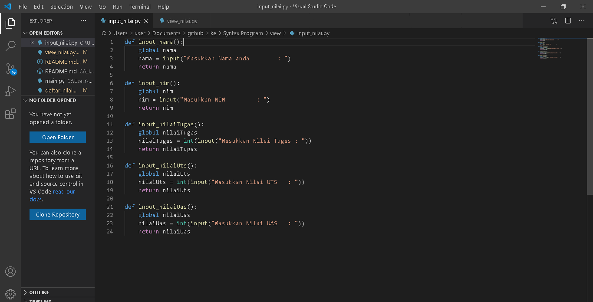

# UAS-Smt-1

## Ujian akhir Indira Rully 312110354 Pemrograman
### Package Module
Membuat package dan modul berdasarkan tugas praktikum sblmnya, yaitu:

##### daftar_nilai.py
berisi modul untuk: tambah_data, ubah_data, hapus_data, dan cari_data

##### view_nilai.py
berisi modul untuk: cetak_daftar_nilai, cetak_hasil_pencarian

##### input_nilai.py
berisi modul untuk: input_data yang meminta pengguna memasukkan data.

##### main.py
berisi program utama (menu pilihan yang memanggil semua menu yang ada

##### hasil dari inputan program 

*Sekian dari saya, mohon maaf jika ada kesalahan. Terimakasih :)*
